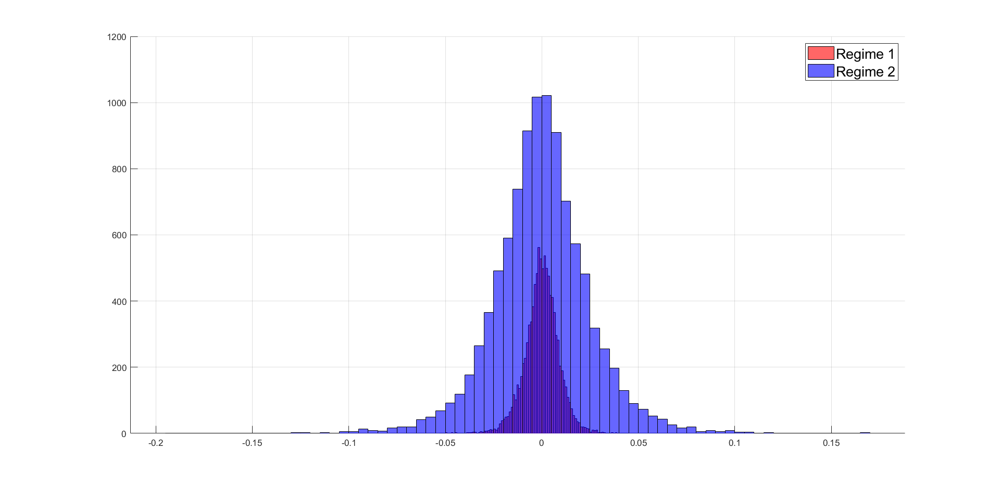

# Portfolio-Diversification-Revisited
We relax a number of assumptions in Alexeev and Tapon (2012) in order to account for non-normally distributed, skewed, multi-regime, and leptokurtic asset return distributions. We calibrate a Markov-modulated Levy process model to equity market data to demonstrate the merits of our approach, and show that the calibrated models do a good job of matching the empirical moments. Finally, we argue that much of the related literature on portfolio diversification relies on assumptions that are in tension with certain observable regularities and which, if ignored, may lead to underestimation of risk.

To facilitate the discussion, we use daily closing price data for the Nasdaq 100 index, taken from [Oxford-Man's Realized Library](https://realized.oxford-man.ox.ac.uk). Our data spans from 04 Jan 2000 - 12 Nov 2021, resulting in 5483 daily observations. The following figure shows the plot of log returns for Nasdaq 100 (blue) with a normal distribution overlay (red). The graph clearly shows that Gaussian density underestimates random variation. This can be explained by the fact that financial returns tend to have distributions with certain stylized features, such as excess kurtosis (i.e., fat or semi-heavy tails), skewness (tail asymmetries), and regime shifts.

Practical modelling of said stylized features may be achieved by the General Hyperbolic Distribution. The special case of the General Hyperbolic Distribution on which we focus our attention is the Normal-Inverse Gaussian (NIG) distribution, a continuous probability distribution defined as the normal variance-mean mixture with an inverse Gaussian mixing density. The four-dimensional parameter vector $[\alpha, \beta, \mu, \delta]$ specifies the form of the NIG density. Due to the extensive parametrization, the NIG density is an advantageous model for a wide range of unimodal positive kurtotic data. The alpha-parameter determines the density's steepness or pointiness, which rises monotonically as $\alpha$ increases. A high alpha value indicates that the tails are light, whereas a small number indicates that the tails are heavy. 

The beta-parameter is used to specify the skewness. The delta-parameter is a scale parameter. The class of NIG distributions is a flexible system of distributions that includes fat-tailed and skewed distributions, and the normal distribution, $N(\mu, \sigma^2)$, arises as a special case by setting  $\beta =0,\delta =\sigma^2\alpha$, and letting $\alpha \rightarrow \infty $.

Consider the following generic Markov Regime Switching (MRS) model:

$$
y_t = f(S_t, theta, psi_{t-1}), \\
S_t = g(\tilde{S}_{t-1}, psi_{t-1}), \\
S_t \in Lambda
$$

where $\theta$ is the vector of the parameters of the model, $S_{t}$ is the state of the model at time $t$, $\psi_t:=\{y_k: k=1,\dots,t\}$ is the set of all observations up to $t$, $\tilde{S}_{t} := {S_{1},...,S_{t}}$ is the set of all observed states up to $t$, $\Lambda=\{1,...,M\}$ is the set of all possible states, and $g$ is the function that regulates transitions between states. Function $f$ indicates how observations at time $t$ depend on $S_t, \theta$, and $\psi_{t-1}$ and finally, $t \in \{0,1,...,T\}$, where $T \in \mathbb{N}\), \(T < +\infty$, is the terminal time.

Equations allow us to address specific issues that may be difficult to represent in a single state regime, which is clearly useful for time series applications. Although the literature on Markov-switching models is diverse, two general groups may be identified. The first group consists of models that have basic transition laws (such as a first order Markov chain) but complex distributions for the data or a high number of states.

